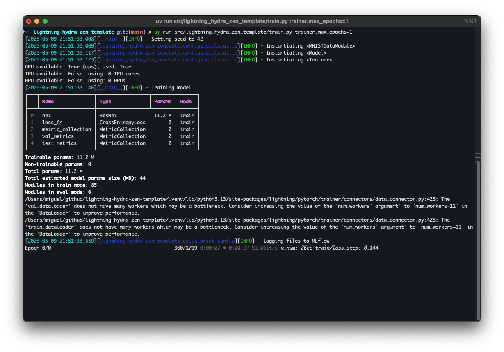

<div align="center">

# sklearn hydra-zen Template
[](https://github.com/pre-commit/pre-commit)
[](https://scikit-learn.org/)
[](https://hydra.cc/)
[](https://github.com/astral-sh/ruff)
[](https://github.com/astral-sh/uv) <br>
[](https://github.com/miguelbper/sklearn-hydra-zen-template/actions/workflows/code-quality.yaml)
[](https://github.com/miguelbper/sklearn-hydra-zen-template/actions/workflows/tests.yaml)
[](https://codecov.io/gh/miguelbper/sklearn-hydra-zen-template)
[](https://github.com/miguelbper/sklearn-hydra-zen-template/blob/main/LICENSE)

A template for machine learning projects using scikit-learn and hydra-zen

Click on [<kbd>Use this template</kbd>](https://github.com/miguelbper/sklearn-hydra-zen-template/generate) to start a new project!

<!-- TODO: fix image -->


</div>

---
<!-- TODO: add better description -->
## Description

A template for machine learning projects, using modern tooling and practices. Implements the features which are common across different machine learning problems (logging, checkpointing, experiment tracking, training and evaluation scripts...) so that you can focus on the specifics of your problem: data analysis and modeling.

Goals of this template:
- Have a low amount of code relative to the functionality being offered
- Be easy to extend by adding new datasets or models, without requiring modifications to the existing code
- Offer a logical and simple to understand folder structure
- Promote best practices for machine learning experiment **correctness** and **reproducibility**

Tech Stack:
- [scikit-learn](https://github.com/scikit-learn/scikit-learn) - ML algorithms
- [Optuna](https://github.com/optuna/optuna) - Hyperparameter optimization
- [MLflow](https://github.com/mlflow/mlflow) - Experiment tracking
- [Hydra](https://github.com/facebookresearch/hydra) - Configuration files
- [hydra-zen](https://github.com/mit-ll-responsible-ai/hydra-zen) - Wrapper for Hydra
- [Ruff](https://github.com/astral-sh/ruff) - Linting and formatting
- [uv](https://github.com/astral-sh/uv) - Dependency management

## Directory structure
```
├── .github/                           <- GitHub Actions workflows
│   └── workflows/
│       ├── code-quality.yaml
│       ├── coverage.yaml
│       ├── publish.yaml
│       └── tests.yaml
│
├── data/                              <- Directory for datasets
│   ├── external/                      <- External data sources
│   ├── interim/                       <- Intermediate results of dataset processing
│   ├── processed/                     <- Datasets ready to be used by the modelling scripts
│   └── raw/                           <- Datasets as obtained from the source
│
├── logs/                              <- Training logs, artifacts, metrics, checkpoints, and experiment tracking data
│
├── notebooks/                         <- Jupyter notebooks for experimentation
│
├── scripts/                           <- Shell scripts
│
├── src/                               <- Source code for the project
│   └── sklearn_hydra_zen_template/  <- Main package directory
│       ├── configs/                   <- Configuration files for Hydra
│       │   ├── groups/
│       │   │   ├── __init__.py
│       │   │   ├── data.py            <- Data module configurations
│       │   │   ├── experiment.py      <- Experiment configurations
│       │   │   ├── hparams_search.py  <- Hyperparameter search configurations
│       │   │   ├── hydra_conf.py      <- Hydra configuration settings
│       │   │   ├── model.py           <- Model configurations
│       │   │   ├── paths.py           <- Path configurations
│       │   │   └── trainer.py         <- Trainer configurations
│       │   │
│       │   ├── utils/                 <- Utility functions for configurations
│       │   ├── __init__.py
│       │   ├── eval.py                <- Main configuration for evaluation
│       │   └── train.py               <- Main configuration for training
│       │
│       ├── data/                      <- DataModules for handling datasets
│       │
│       ├── model/                     <- Modules
│       │
│       ├── utils/                     <- Utility functions
│       │
│       ├── __init__.py
│       ├── eval.py                    <- Main testing / evaluation script
│       └── train.py                   <- Main training script
│
├── tests/                             <- Automated tests
│
├── .envrc.example                     <- Example environment variables file (rename to .envrc)
├── .gitignore
├── .pre-commit-config.yaml
├── .python-version                    <- Python version that will be installed
├── img.png
├── justfile                           <- Project commands
├── LICENSE
├── pyproject.toml                     <- Project configuration file with dependencies and tool settings
├── README.md
└── uv.lock                            <- The requirements file for reproducing the environment
```

## Reproducibility of ML experiments

One of the goals of this template is to help users in creating **correct** and **reproducible** ML code.

Libraries like Hydra and hydra-zen help with this objective:
- We can create configuration files which are hierarchical and composable/overridable.
- With hydra-zen we can automatically create configurations for the full signature of an object without code duplication.
- This results in a resolved configuration with full information about the experiment that was run.
- The hierarchy of the configuration completely mirrors that of the classes being used, which makes it easy to understand.

Here is an example of a resolved config file (that is printed to the terminal and the `logs/` directory).

<details>
<summary>Click to expand the resolved config</summary>

<!-- TODO: Include resolved config -->
```

```
</details>


## Installation

```bash
# Install dependencies
uv sync

# Run unit tests
uv run pytest
```

## Usage

To train or evaluate a model on IRIS, do:
```bash
# Train
uv run src/sklearn_hydra_zen_template/train.py

# Evaluate
uv run src/sklearn_hydra_zen_template/eval.py ckpt_path=...
```

To define a new experiment, it is necessary to:
- Define the dataset, by creating a `DataModule` in `data/`
- Define the model, by creating a `Module` in `model/`
- Define a configuration for this experiment, by adding new config group options to `configs/groups/data.py` and `configs/groups/model.py`
- Or, create a new experiment config in `configs/groups/experiment.py` by adding the group options defined above to this new experiment

With this done, you can train with the data and model specified above by overriding the corresponding groups from the command line:
```bash
# Override data and model groups individually
uv run src/sklearn_hydra_zen_template/train.py data=new_datamodule model=new_model

# Or, override with a new experiment config
uv run src/sklearn_hydra_zen_template/train.py experiment=new_experiment
```

## License

This project is licensed under the MIT License - see the [LICENSE](LICENSE) file for details.

## Acknowledgements
This template is an adaptation of [miguelbper/lightning-hydra-zen-template](https://github.com/miguelbper/lightning-hydra-zen-template) to solve machine learning problems with scikit-learn. In turn, that template was inspired by inspired by [ashleve/lightning-hydra-template](https://github.com/ashleve/lightning-hydra-template) and [drivendataorg/cookiecutter-data-science](https://github.com/drivendataorg/cookiecutter-data-science).
